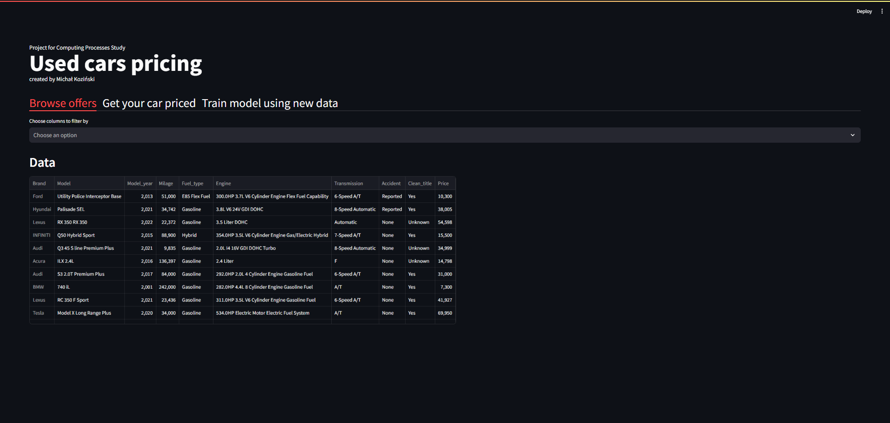
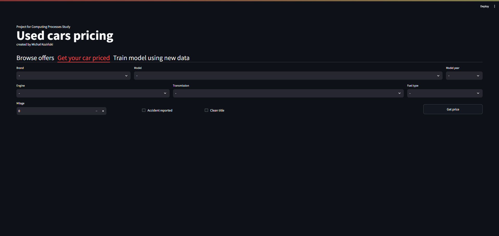
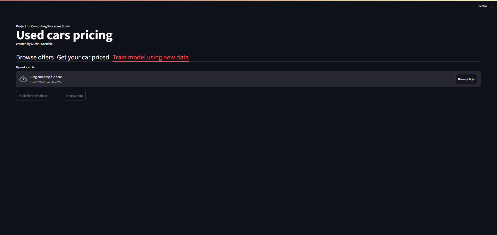

# Used cars pricing

## Table of Contents
1. Introduction
2. Technologies
3. Setup
4. Visual presentation

___

## Introduction

This project is created for Computing Processes Study. 

The result of the work on this project is a system of microservices communicating with each other, consisting of a machine learning module, database and visual interface in the form of a web-app.

Among the provided functionalities are:

- browsing used cars database,
- pricing car based on provided data,
- updating model with new data.

___

## Technologies
This project was created with:
- &nbsp;**Docker**: 25.0.3
- &nbsp;**MySQL**: 8.3.0
- &nbsp;**Python**: 3.10
- &nbsp;**Streamlit**: 1.33.0
- &nbsp;**FastAPI**: 0.110.0

___

## Setup
In few steps I will describe process how run software by yourself.

### Prerequisites
To install this software and be able to run it you need to previously install Docker on your machine. If you don't have Docker you can download it from official distribution: [docker.com](<https://www.docker.com/products/docker-desktop/>).

### Installing application
After you clone repository you need to run system terminal and go to directory 'Projekt' which contains all files.

Next you need to set up application by building container, to achieve this run command 'docker compose up -d'.

### Running application
Finally, you should be able to use application by going to <http://localhost:5001/>

___

## Visual presentation

